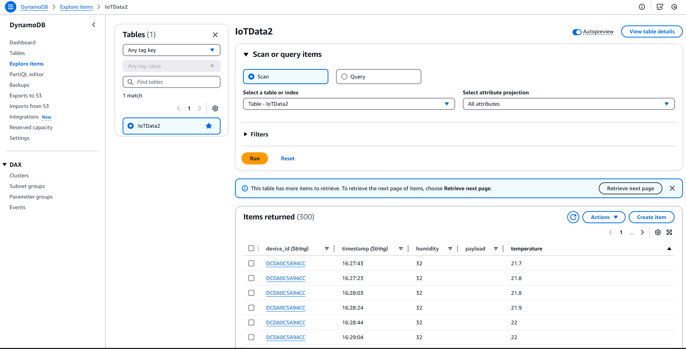

# IoT Data Dashboard

## Introduction

This project demonstrates how to build an end-to-end IoT solution for monitoring temperature and humidity using an ESP32 microcontroller and AWS IoT. It is ideal for developers learning about IoT or building scalable sensor-based solutions. The solution integrates hardware and software to collect, store, and visualize sensor data in real time.

## Description

This project is an IoT solution using an ESP32 device and a DHT11 sensor to measure temperature and humidity, sending data to AWS IoT. A Flask application retrieves the data and displays it in a real-time web interface with visual charts.

The following diagram illustrates the overall system architecture, showing how data flows from the DHT11 sensor through the ESP32 to AWS IoT Core, DynamoDB, and finally to the Flask web application:


### Features:

- **ESP32 Connectivity**: The ESP32 device connects to Wi-Fi and transmits data to AWS IoT using MQTT.
- **Cloud Storage**: Data is stored in a DynamoDB database for durability and accessibility.
- **Real-Time Dashboard**: A Flask application processes and visualizes the data using Chart.js, providing live temperature and humidity charts.

---

## Components

### Hardware

- **ESP32**: The microcontroller used to collect and transmit sensor data.
- **DHT11 Sensor**: Measures temperature and humidity.
- **Breadboard and wires**: For prototyping and connections.
- **Resistor (10kΩ)**: Used for the pull-up configuration with the DHT11 sensor.

### Software and Services

- **Arduino IDE**: Used to write and upload the ESP32 firmware.
- **AWS IoT Core**: Handles secure communication between the ESP32 and the cloud.
- **DynamoDB**: Stores the temperature and humidity data.
- **Flask (Python)**: Provides the backend server to retrieve data from DynamoDB and display it.
- **Chart.js**: Renders the real-time temperature and humidity charts on the web interface.

---

## Installation

### 1. Configure ESP32

To configure the ESP32 to read data from the DHT11 sensor and send it to AWS IoT, follow these steps:

1. Install **Arduino IDE** and add the ESP32 support library.
2. Download necessary libraries:
   - `WiFi.h`: Handles the Wi-Fi connection.
   - `MQTTClient.h`: Enables communication with AWS IoT via MQTT.
   - `ArduinoJson.h`: Parses and formats JSON data.
   - `DHT.h`: Reads temperature and humidity data from the DHT11 sensor.
   - `NTPClient.h`: Fetches the current time from an NTP server.
3. Connect the DHT11 sensor to the ESP32 as shown in the diagram below:

   

4. Copy and paste the ESP32 code from `main.cpp` into Arduino IDE.
5. Update `secrets.h` with your AWS IoT credentials and Wi-Fi details:
   ```cpp
   #define WIFI_SSID "Your_SSID"
   #define WIFI_PASSWORD "Your_PASSWORD"
   #define AWS_IOT_ENDPOINT "Your_AWS_IoT_Endpoint"
   #define AWS_CERT_CA "Your_Root_CA.pem"
   #define AWS_CERT_CRT "Your_Certificate.pem.crt"
   #define AWS_CERT_PRIVATE "Your_Private.pem.key"

Note: Keep secrets.h private and do not share it, as it contains sensitive credentials.

6. Compile and upload the code to the ESP32.

7. Verify:

   - Open the serial monitor in Arduino IDE.
   - Set the baud rate to 115200.
   - Check for messages confirming a successful connection to Wi-Fi and AWS IoT.


### 2. Flask Application
The Flask application acts as the backend server that retrieves data from DynamoDB and serves it to the web dashboard.

1. Install Python and required libraries:
   ```bash
   pip install flask boto3
   ```
2. Update the Flask code:
   - Set the correct AWS region in `boto3.resource` to match your DynamoDB configuration.
   - Ensure the DynamoDB table is named `IoTData2`.
3. Run the Flask application:
   ```bash
   python app.py
   ```
4. The Flask server will run at http://127.0.0.1:5000/. Open this URL in your web browser to view the dashboard.

5. Verify:

   - Check the terminal output to ensure there are no errors.
   - If the server fails to start, ensure that all required libraries are installed and that your AWS credentials are configured correctly.

### 3. Configure AWS IoT
1. Log in to your AWS Management Console.
2. Navigate to **AWS IoT Core** > **Manage** > **Things**.
3. Click on **Create things** and configure a new device (Thing) as shown below:

   

4. Download the security credentials (certificates and keys) for your device.
   - These credentials will be used by your ESP32 to securely connect to AWS IoT Core.
   - Make sure to keep the downloaded files in a secure location.

5. Attach an IoT Policy to your Thing to grant appropriate permissions.
   - The policy should allow the following actions:
     - **iot:Connect**: Allows the device to connect to AWS IoT Core.
     - **iot:Publish**: Allows the device to send messages to AWS IoT topics.
     - **iot:Subscribe**: Allows the device to subscribe to specific topics.
     - **iot:Receive**: Allows the device to receive messages from subscribed topics.

   Below is an example of a minimal IoT Policy:
   ```json
   {
     "Version": "2012-10-17",
     "Statement": [
       {
         "Effect": "Allow",
         "Action": [
           "iot:Connect",
           "iot:Publish",
           "iot:Subscribe",
           "iot:Receive"
         ],
         "Resource": "*"
       }
     ]
   }

6. Save the policy and attach it to your Thing.

Note: Ensure that the policy is scoped appropriately for production environments. Granting access to all resources ("Resource": "*"), as shown above, is suitable for testing but should be refined for security in production.

### 4. Configure DynamoDB
1. Log in to your AWS Management Console.
2. Navigate to **DynamoDB** > **Tables**.
3. Create a new table named `IoTData2` with the following settings:
   - **Partition Key**: `device_id` (String) - This uniquely identifies the IoT device.
   - **Sort Key**: `timestamp` (String) - This ensures the data is stored in chronological order for each device.
   
   Below is an example of the table configuration:

   

## Usage

### Step 1: ESP32 to AWS IoT
1. Power up the ESP32 and connect it to Wi-Fi. It will start sending data to AWS IoT.
2. Below is an example of the serial monitor output showing the ESP32 device connecting to AWS IoT and sending temperature and humidity data:

   

### Step 2: AWS IoT Core
3. The data is sent to AWS IoT Core. Below is an example of AWS IoT Core's telemetry data being received via MQTT:

   

### Step 3: Data Storage in DynamoDB
4. The data is stored in DynamoDB. Below is an example of the data stored in DynamoDB, which includes `device_id`, `timestamp`, `temperature`, and `humidity` values:

   

### Step 4: Data Visualization
5. The Flask application retrieves data from DynamoDB and updates the interface.
6. Open a browser and navigate to `http://127.0.0.1:5000/` to view live data. Below is an example of the live dashboard displaying temperature and humidity data:

   


## Directory Structure
```
project/
├── app.py                 # Flask server
├── templates/
│   └── index.html         # HTML dashboard
├── static/
│   └── charts.js          # Chart.js configuration
├── main.cpp               # ESP32 code
├── secrets.h              # AWS and Wi-Fi configuration
└── README.md              # Documentation
```

